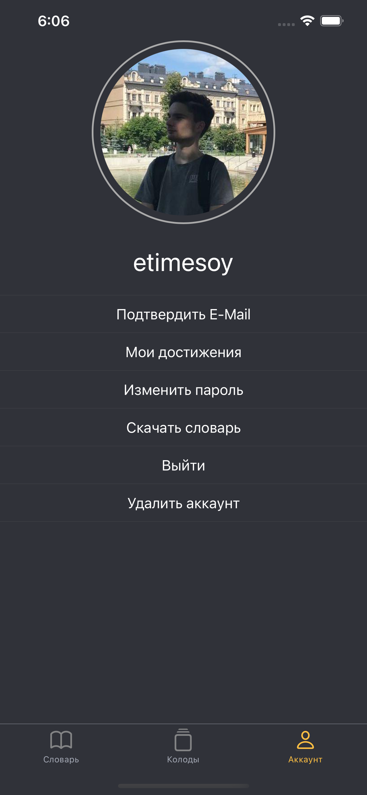
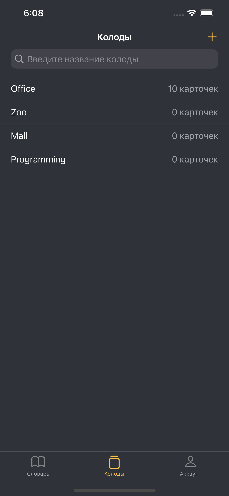
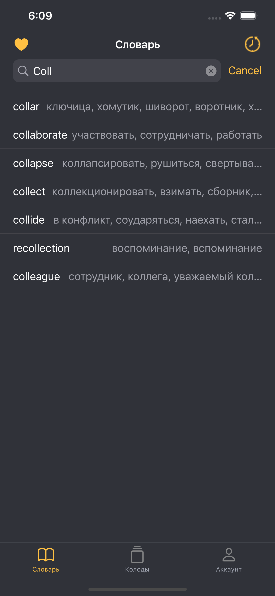
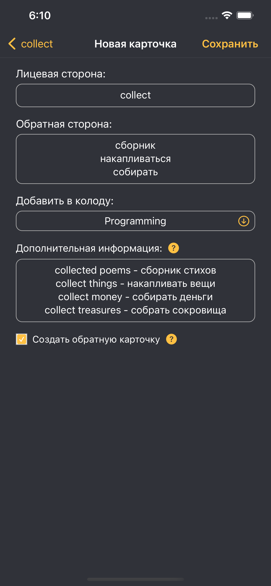

<!-- PROJECT SHIELDS -->
[![Contributors][contributors-shield]][contributors-url]
[![Stargazers][stars-shield]][stars-url]
[![Issues][issues-shield]][issues-url]
[![MIT License][license-shield]][license-url]


<!-- PROJECT LOGO AND BRIEF DESCRIPTION -->
<br />
<p align="center">
  

  <h3 align="center">Find & Learn</h3>

  <p align="center">
    Application for searching en-ru and ru-en translations of words <br /> and learning them w/ the power of flashcards😉
    <br />
    <a href="https://youtu.be/89d175tK9c0">View Demo</a>
    ·
    <a href="https://github.com/etimesoy/Find-and-Learn/issues">Report Bug</a>
    ·
    <a href="https://github.com/etimesoy/Find-and-Learn/issues">Request Feature</a>
  </p>
</p>


<!-- FEATURES -->
## Featues

*  Create decks and flashcards, specifying the front side, the back side and, if neccesary, the comment (might be useful for usage examples)
*  Search for translations of words and quickly create flashcards based on them and examples of their use
*  Download 4.5k most popular english words with translations from self-made backend, hosted on Heroku - <a href="https://find-and-learn-web.herokuapp.com/docs">check the backend API docs</a>
*  Check your achievements to stay on track
*  Mark words as favorite to reference them later
*  Take a look at the history of the words you were searching
*  Register an account using your email address. A confirmation code will be sent :)
*  Toggle appearance - both light and dark modes are supported


<!-- TOOLS -->
## Tools

* [SwiftLint](https://github.com/realm/SwiftLint) - A tool to enforce Swift style and conventions
* [SnapKit](https://github.com/SnapKit/SnapKit) - A Swift Autolayout DSL for iOS & OS X
* [R.swift](https://github.com/mac-cain13/R.swift) - Strong typed, autocompleted resources like images, fonts and segues in Swift projects
* [Alamofire](https://github.com/Alamofire/Alamofire) - Elegant HTTP Networking in Swift
* [Swinject](https://github.com/Swinject/Swinject) - A lightweight dependency injection framework for Swift
* [CocoaPods](https://cocoapods.org) as a dependency manager
* Core Data, UserDefaults and Keychain for persistent data storing
* VIPER as an architectural pattern
* UIKit as a framework for user interface


<!-- SCREENSHOTS -->
## Screenshots

<p align="middle">
  
  
  
  
  
  
</p>


<!-- GETTING STARTED -->
## Getting Started

To get a local copy up and running follow these simple steps:

1. Clone the repo
   ```sh
   git clone https://github.com/etimesoy/Find-and-Learn.git
   ```
2. Change the current directory to Find-and-Learn
   ```sh
   cd Find-and-Learn
   ```
3. Install the dependencies
   ```sh
   pod install
   ```
4. Open Find-and-Learn.xcworkspace file
   ```sh
   open Find-and-Learn.xcworkspace
   ```
5. When Xcode opens, launch the app using a simulator or your device by choosing Product -> Run


<!-- LICENSE -->
## License

Distributed under the MIT License. See `LICENSE` for more information.


<!-- CONTACT -->
## Contact

Ruslan Gazizov - [@etimesoy](https://t.me/etimesoy) - ruslangazizov36@gmail.com

Project Link: [https://github.com/etimesoy/Find-and-Learn](https://github.com/etimesoy/Find-and-Learn)


<!-- MARKDOWN LINKS & IMAGES -->
[contributors-shield]: https://img.shields.io/github/contributors/etimesoy/Find-and-Learn.svg?style=for-the-badge
[contributors-url]: https://github.com/etimesoy/Find-and-Learn/graphs/contributors
[forks-shield]: https://img.shields.io/github/forks/etimesoy/Find-and-Learn.svg?style=for-the-badge
[forks-url]: https://github.com/etimesoy/Find-and-Learn/network/members
[stars-shield]: https://img.shields.io/github/stars/etimesoy/Find-and-Learn.svg?style=for-the-badge
[stars-url]: https://github.com/etimesoy/Find-and-Learn/stargazers
[issues-shield]: https://img.shields.io/github/issues/etimesoy/Find-and-Learn.svg?style=for-the-badge
[issues-url]: https://github.com/etimesoy/Find-and-Learn/issues
[license-shield]: https://img.shields.io/github/license/etimesoy/Find-and-Learn.svg?style=for-the-badge
[license-url]: https://github.com/etimesoy/Find-and-Learn/blob/main/LICENSE
